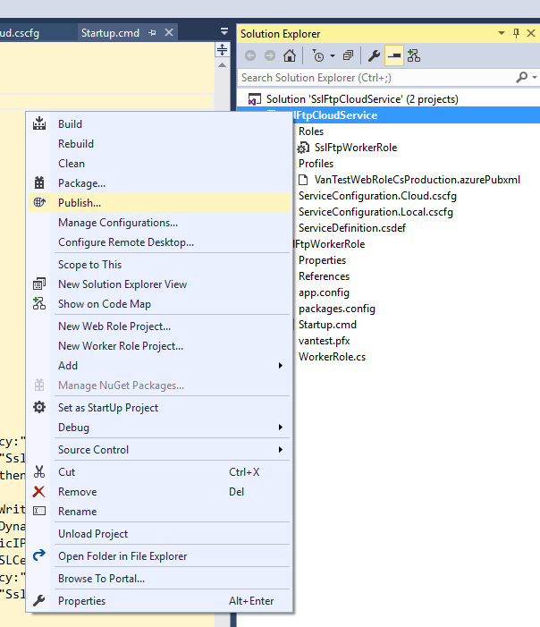
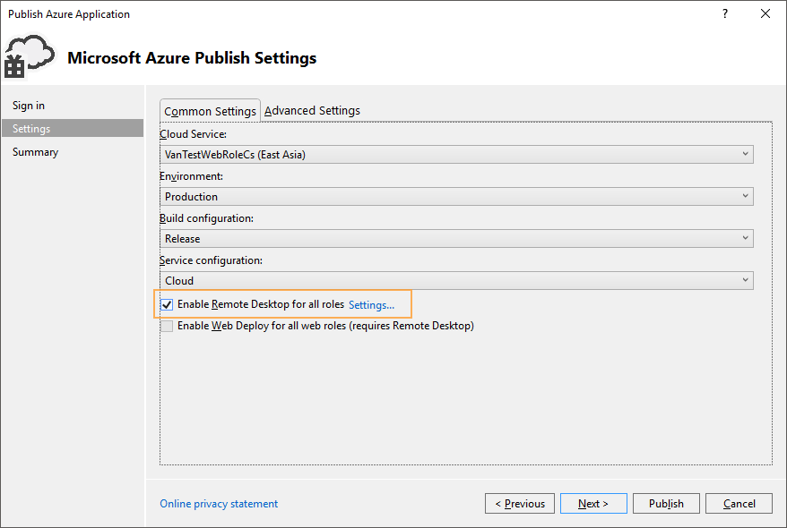

# How to execute PowerShell from mounted Azure storage file disks in Azure Cloud service worker role

## Introduction
When we use Azure Cloud Service and Azure Storage, we always keep some common files in Azure Storage and make Azure Cloud Service directly read those files from storage service.

In this example, you will learn how to mount an Azure Storage shared file service as a remote to cloud service instance in a startup task.

You will also learn how to execute a PowerShell script in startup tasks and avoid the warning for PowerShell policy conflicts.   

## Prerequisites
*__1.	Create Azure File storage__*

Please follow the below document to create an Azure File storage.

https://azure.microsoft.com/en-us/documentation/articles/storage-dotnet-how-to-use-files/

Instead of running all the steps in this document, you just need to create an Azure File folder in Azure portal.

Please record the storage account name and access key because they will be used in further steps.

*__2.	Upload test to execute PowerShell script__*

When Azure File storage folder is ready, please use Azure portal to upload test PowerShell script file.

In this example, the script file name is “test.ps1”. Below is the content of this file.

```PowerShell
Get-Date -Format "yyyy-MM-dd HH:mm:ss" | Out-File $env:TEMP\PSLog.txt
```

*__3.	Create test cloud service__*

Please follow below document to create an Azure Cloud Service.

https://azure.microsoft.com/en-us/documentation/articles/cloud-services-how-to-create-deploy-portal/


## Building the Sample
*__1.	Create Solution in Visual Studio 2015__*

Now you can use Visual Studio 2015 to build a cloud service solution. This solution contains one cloud service project and a worker role project.

*__2.	Configure Service Definition File__*

Open ServiceDefinition.csdef and change content as below.

```xml
<?xml version="1.0" encoding="utf-8"?>
<ServiceDefinition name="AzureCloudService1" xmlns="http://schemas.microsoft.com/ServiceHosting/2008/10/ServiceDefinition" schemaVersion="2015-04.2.6">
  <WorkerRole name="WorkerRole1" vmsize="Small">
    <Runtime executionContext="elevated" />
    <ConfigurationSettings>
      <Setting name="Microsoft.WindowsAzure.Plugins.Diagnostics.ConnectionString" />
    </ConfigurationSettings>
    <LocalResources>
    </LocalResources>
    <Imports>
      <Import moduleName="RemoteAccess" />
      <Import moduleName="RemoteForwarder" />
    </Imports>
  </WorkerRole>
</ServiceDefinition>
```

This configuration

```xml
<Runtime executionContext="elevated" />
```

makes worker role service run under administrator mode, since we need to use the administrator authority to run mounted disk commands.

*__3.	Write Startup.cmd Content__*

Create a Startup.cmd file to Worker Role project root path.

Startup.cmd will set PowerShell global execution policy to prevent the policy-not-enough warning. It will also mount the storage file folder as remote disk.

Please refer to the codes in our example solution and replace the storage account and access key with yours.

*__4.	Write Worker Role Code to execute cmd and PowerShell script__*

Please modify WorkerRole.RunAsync method as below codes.

First, these codes run under the administrator role to execute startup.cmd to mount disk.

Then it will execute PowerShell test.ps1

```c#
        private async Task RunAsync(CancellationToken cancellationToken)
        {
            try
            {
                string appRoot = Environment.GetEnvironmentVariable("RoleRoot");
                string fullPath = Path.Combine(appRoot + @"\", @"AppRoot\startup.cmd");
                ProcessStartInfo startInfo = new ProcessStartInfo(fullPath)
                {
                    UseShellExecute = false,
                    RedirectStandardOutput = true,
                    Verb = "runas"
                };

                Process p = System.Diagnostics.Process.Start(startInfo);
                using (StreamReader reader = p.StandardOutput)
                {
                    string processResult = reader.ReadToEnd();
                    File.AppendAllText(Path.Combine(Path.GetTempPath(), "startProcess.log"), processResult + "\r\n\r\n");
                }
                p.WaitForExit();
            }
            catch (Exception ex)
            {
                File.WriteAllText(Path.Combine(Path.GetTempPath(), "startProcess.log"),
                    ex.ToString() + "\r\n\r\n");
            }

            var hasRunPs = false;
            // TODO: Replace the following with your own logic.
            while (!cancellationToken.IsCancellationRequested)
            {
                Trace.TraceInformation("Working");
                if (!hasRunPs)
                {
                    try
                    {
                        File.AppendAllText(Path.Combine(Path.GetTempPath(), "PS.log"), "start PS\r\n\r\n");
                        ProcessStartInfo startInfo = new ProcessStartInfo("powershell.exe")
                        {
                            UseShellExecute = false,
                            RedirectStandardOutput = true,
                            RedirectStandardError = true,
                            Verb = "runas"
                        };

                        startInfo.Arguments = @"P:\test.ps1";
                        Process p = System.Diagnostics.Process.Start(startInfo);

                        using (StreamReader reader = p.StandardOutput)
                        {
                            string result = reader.ReadToEnd();
                            File.AppendAllText(Path.Combine(Path.GetTempPath(), "PS.log"), result + "\r\n\r\n");
                        }

                        using (StreamReader reader = p.StandardError)
                        {
                            string result = reader.ReadToEnd();
                            File.AppendAllText(Path.Combine(Path.GetTempPath(), "PS.log"), result + "\r\n\r\n");
                        }
                    }
                    catch (Exception ex)
                    {
                        File.WriteAllText(Path.Combine(Path.GetTempPath(), "startProcess.log"),
                            ex.ToString() + "\r\n\r\n");
                    }
                    hasRunPs = true;
                }
                await Task.Delay(1000);
            }
        }
```

## Running the Sample

Right click cloud service project and choose “Publish…” command.

 

Before we publish this cloud service, please enable RDP and set an RDP account. You can click "Enable Remote Desktop for all roles" under Cloud section.

 

 You can use this RDP account to do below things.

 •	RDP to the instance to troubleshoot if the startup task or FTP configuration failed.

 •	Use this account to login FTP.


## Using the Code

You can RDP to instance and check the following folder to verify that PowerShell script has been successfully executed.

*C:\\Resources\\temp\\[deployment_id].WebRole1\\RoleTemp*

There should be a “PSLog.txt” file under this folder. The file content should be a date time.

Here are some key points to understand.

**Why can’t we run startup.cmd in startup task?**

It is because cloud service startup task and the main logic of worker role is running under different system accounts.

Windows remote disk is protected by its security setting. Worker role account cannot access the remote disk which was mounted by startup task execution account.

**Why can’t I see the remote disk P when I RDP to the instance?**

The reason is the same as the above question.

It is the remote desktop account with which you logged into the instance, but not the account that mounted the disk.
